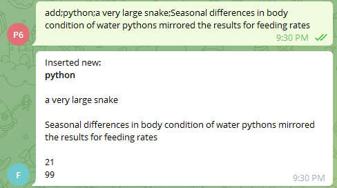
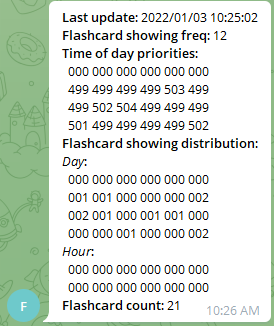

# mobile-flashcards README

# Table of contents
1. [Background](#Background)
1. [Prerequisites](#Prerequisites)
1. [Warnings](Warnings)
1. [Installation guide](#Installation-guide)
1. [Installation verification](#Installation-verification)
1. [Optional set-ups](#Optional-set-ups)
1. [Usage](#Usage)
1. [Licensing](#Licensing)
1. [Dependencies](#Dependencies)
1. [Versioning](#Versioning)

# Background
It is very common for me to have learnt something, and then forgetting it after a day or two, if the same information does not appear to me repeatedly. Using flashcards may help. However, I'm too lazy to jot things down on physical flashcards. Even if I have written some, I may not have the motivation to pick them up and refresh my memory. Flashcard Apps could be an alternative. I want to have a handy flashcard system which I can add and delete flashcards, and the flashcard system will pop up random flashcards I added from time to time. Instead of searching the App store / Google Play Store for an app that meets my requirements, which are usually too bulky in functionalities, I decided to make one myself. 

The project uses *Docker* as the platform. *MongoDB* as the backend to store the flashcards. *Telegram* as the frontend to interact with the user. Python as the programming language to link everything up. 

# Prerequisites
1. A computer
2. [Telegram](https://telegram.org/) installed on your phone

# Warnings
1. This project was tested on *Ubuntu Focal 20.04* only. The [_Installation guide_](#Installation-guide) may not be applicable to other versions and operating systems.

# Installation guide
1. Install Docker Engine.
    - [Offical tutorial](https://docs.docker.com/engine/install/)
1. Manage Docker as a non-root user.
    - Apply to Linux users only
    -  [Offical tutorial](https://docs.docker.com/engine/install/linux-postinstall/#manage-docker-as-a-non-root-user)
1. Configure Docker to start on boot.
    - Apply to Linux users only
    - [Offical tutorial](https://docs.docker.com/engine/install/linux-postinstall/#manage-docker-as-a-non-root-user)
1. Install Docker Compose.
    - Apply to Linux users only
    - [Offical tutorial](https://docs.docker.com/compose/install/)
1. Create a new Telegram bot
    - [Offical tutorial](https://core.telegram.org/bots#creating-a-new-bot)
1. Obtain your Telegram Chat ID
    - Send any message to your bot created in the step "Create a new Telegram bot".
    - In a web browser, go to the following URL: `https://api.telegram.org/bot<token>/getUpdates`, where `<token>` in the URL should be replaced with the *token* obtained in the step "Create a new Telegram bot".
    - The browser should return a JSON format string like: 
        ```
        {"ok":true,"result":[{"update_id":452275448,"message":{"message_id":489,"from":{"id":123456789,"is_bot":false, ...
        ```
    - The integer following `"id":` will be your Chat ID.
    - [Reference](https://stackoverflow.com/questions/32423837/telegram-bot-how-to-get-a-group-chat-id)
1. Clone this repository to the host machine.
    - [Offical tutorial](https://git-scm.com/book/en/v2/Git-Basics-Getting-a-Git-Repository)
1. Set up `.env`
    - In the project directory, copy `.env.example` and name it as `.env`.
    - Copy and paste the *token* obtained in the step "Create a new Telegram bot" after `TG_FLASHCARD_BOT_TOKEN=`.
    - Copy and paste the *Chat ID* obtained in the step "Obtain your Telegram Chat ID" after `TG_FLASHCARD_BOT_CHAT_ID=`.
    - Refer to [here](#Optional-set-ups) for optional setups.
1. Build the containers
    - Run command `DOCKER_BUILDKIT=1 docker-compose build`.
    - [Official Manual](https://docs.docker.com/compose/reference/build/)
1. Start the containers
    - Run command `docker-compose up -d`.
    - [Official Manual](https://docs.docker.com/compose/reference/up/)

# Installation verification
In telegram, send the word `info` to your bot. Installation is successful if you get a reply.

# Optional set-ups
## `.env` file
If any value is changed after the step *Build the containers* in the [Installation guide](#Installation-guide), perform the steps *Build the containers* and *Start the containers* again so the change will take effect. 

### `FLASHCARDS_MANAGER_NUM_JOBS_PER_HOUR`
- Number of times in an hour that the bot will determine whether to perform flashcard pop-up(s) or not. Default is *12*, that is, the bot would consider flashcard pop-up(s) at every 5 minutes. You can change it to an integer given that *60* is divisible by it. i.e. 1, 2, 3, 4, 5, 6, 10, 12, 15, 20, 30, 60. 

# Usage
## Prologue
Every message you sent to your bot should follow a specific format. If the format is not observed, the bot will not be able to interpret the message and `Unknown instruction` will be replied. 

Basically, an instruction has the following format:
```
<instruction type>; <parameter 1>; <parameter 2>; <parameter 3>
```

Every message should start with the *instruction type*. If the instruction does not need extra parameters, send it and the bot will be able to interpret the instruction and give you a reply. 

If the instruction does require extra parameter(s), separate them with a semi-colon. Because of this, you must not contain any semi-colon in you parameter strings. Otherwise, the bot will treat it as a parameter separator. 

You are allowed to add or not adding whitespaces before and after the semi-colons. These whitespaces will be removed anyway. For example, the following ways are all valid. 
```
<instruction type>;<parameter 1>
<instruction type>;   <parameter 1>
<instruction type>    ; <parameter 1>
<instruction type>;<parameter 1>
```

Instruction types are not case-sensitive. That is, for the instruction *add*, you can also type *Add* / *ADD* / *aDd*, etc. However, parameters are case-sensitive, so you may store the word *apple* and *Apple* as two flashcards. 

## Available instructions
### Add a flashcard
```
add; <key>; <explanation>; [remarks]
```
- Parameters:
    - *key*: the word / phase that you want to memorize. **Cannot** be pure numbers.
    - *explanation*: the explanation of the key so that you know what it means
    - *remarks* (Optional): Some extra information you would like to add. e.g. an example usage of the key in a sentence.
- Reply from bot:
    - The flashcard produced.  
        
    - The integers `21` and `99` at the bottom of the flashcard represents its *ID* and *priority* respectively. 
    - The *ID* is unique for each flashcard, and can be used to refer to the flashcard in some other instructions. 
    - See instruction [Change flashcard priority](#Change-flashcard-priority) for detailed description of flashcard *priority*.

### Delete a flashcard
```
del; <key>
```
- Parameters:
    - *key*: The *key* or the *ID* of the flashcard you want to delete.
- Reply from bot:
    - The *key* of the flashcard being deleted.  
        

### Show a flashcard
```
show; <key>
```
- Usage:
    - Recalled a key and you want to obtain its meaning.
- Parameters:
    - *key*: The *key* or the *ID* of the flashcard you want to show.
- Reply from bot:
    - The flashcard.
- Notices
    - Refer to the instruction [Add a flashcard](#Add-a-flashcard) for detailed description of the flashcard.
    - This instruction will not affect the priority of the flashcard.

### Change flashcard priority
```
pri; <key>; <value>
```
- Background:
    - The *priority* of the flashcard affects the probability of popping up. The range of value is `[0, 99]`. A higher value means a higher chance that the bot will select this flashcard and show to you. After the flashcard being selected and shown by the bot, its priority will decrease. As a result, a freshly added flashcard would popped up frequently at the first few days, and its appearance would decrease subsequently.
- Usage:
    - Increase / decrease the probability of the flashcard being seleted by the bot for random flashcard pop ups.
- Parameters:
    - *key*: The *key* or the *ID* of the flashcard you want to have the priority changed.
    - *value*: The value to be added to the flashcard's current priority. If you want to reduce the priority, provide a negative value. If the value is not provided, *1* is assumed.
- Reply from bot:
    - The *key* of the flashcard with priority changed.

### Change time priority
```
time; <hour index>; <value>
```
- Background:
    - Each hour in the 24-hour clock format has its priority value. This value determines the probability of the bot to perform flashcard pop up(s) in this hour. The range of priority value is `[0, 999]`, larger for higher priority. 
    - Initially, Hour *0* to *6* have priority values of *0*, meaning that the bot will not perform any flashcard pop up in these hours. Hour *7* to *23* have priority value of *499*, meaning that these hours have the same probability for flashcard pop up(s). 
    - Whenever the bot receives a valid instruction, the priority at that hour may increase by 1.
    - If the priority of any hour exceeds *999*, all the hours will have their priorities rescaled so that all values will be within the limit, while conserving the priority ratio between hours.
- Usage:
    - Increase / decrease the probability of flashcard pop up(s) for a specific hour. 
- Parameters:
    - *hour index*: The hour to have its priority changed. Range is `[0, 23]`, in local time zone. 
    - *value*: The value to be added to the hour's current priority. If you want to reduce the priority, provide a negative value. If the value is not provided, *1* is assumed.
- Reply from bot:
    - The new priority value at that hour.

### Change flashcard pop-ups frequency
```
freq; <value>
```
- Usage:
    - Set the maximum number of flashcard pop-ups in a day. 
- Parameters:
    - *value*: THe number of flashcard pop-ups you would like to see in a day. (Default: 10)
- Reply from bot:
    - The new frequency value.

### Show flashcard system info
```
info
```
- Usage:
    - Show information of the current flashcard system.  
- Reply from bot:  
    - Exmaple:  
    
    - All the 3-digit arrays are in row-major order.
    - *Flashcard showing distribution*: 
        - *Day*: number of flashcard pop-ups at each hour of the day. It will be regenerated at the start of each day, or whenever the *flashcard pop-ups frequency* changed.
        - *Hour*: number of flashcard pop-ups at each *job* of the current hour. It will be regenerated at the start of each hour, or whenever the *flashcard pop-ups frequency* changed. Number of *jobs* in an hour is defined in the `.env` file. 

### Show helps
```
help; [instruction type]
```
- Usage:
    - Obtain the list of available instructions, or the usage of a particular instruction.
- Parameters:
    - instruction type (Optional): Provide the instruction type if you want to know the usage of a particular instruction. Ignore it if you just want to obtain the list of available instructions.
- Reply from bot:
    - The list of available instructions, or the usage of a particular instruction.

# Licensing
This project is licensed under the MIT License. See [LICENSE](./LICENSE) for the full license text.

# Dependencies
This project is dependent on third-party libraries or other resources listed below.

1. Docker
    - Docker Inc.
    - [Apache License 2.0](https://docs.docker.com/engine/install/#licensing)
1. Docker compose
    - Docker Inc.
    - [Apache License 2.0](https://github.com/docker/compose/blob/v2/LICENSE)
1. MongoDB
    - MongoDB, Inc.
    - [Server Side Public License (SSPL) v1](https://github.com/mongodb/mongo/blob/master/LICENSE-Community.txt)
1. NumPy
    - NumPy Developers.
    - [NumPy license](https://numpy.org/doc/stable/license.html#)
1. pymongo
    - MongoDB, Inc.
    - [Apache License 2.0](https://github.com/mongodb/mongo-python-driver/blob/master/LICENSE)
1. python-telegram-bot
    - python-telegram-bot
    - [LGPL-3](https://github.com/python-telegram-bot/python-telegram-bot/blob/master/LICENSE)

# Versioning
This project follows the [Semantic Versioning 2.0.0](https://semver.org/spec/v2.0.0.html)
